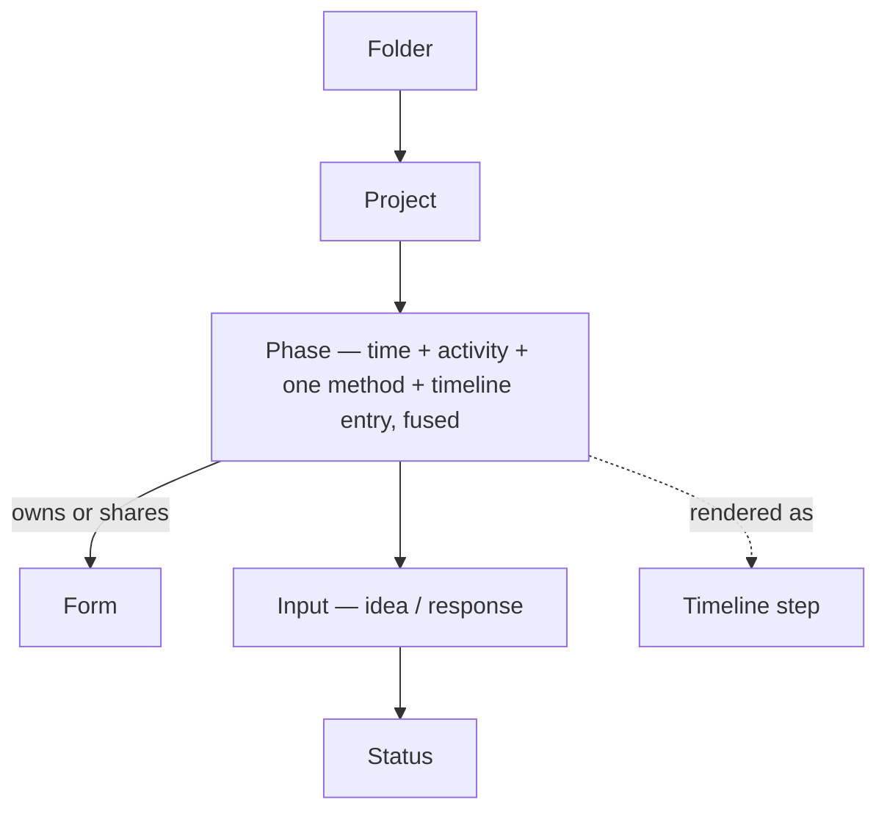
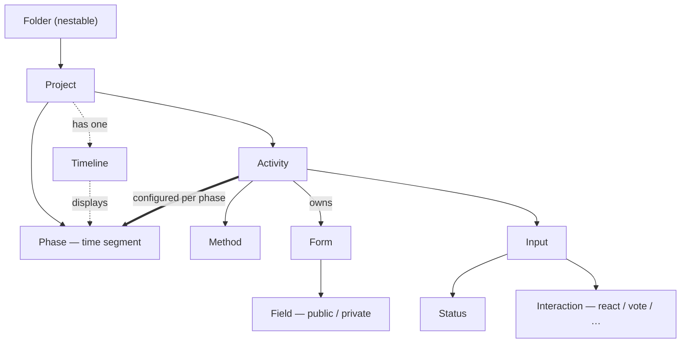

# Parallel Participation — Research

Research and proposed direction for the parallel-participation track. The first four parts are **descriptive research** — needs, prior art, and a shared vocabulary, with no solution baked in. The final part, **Solution direction**, is an **opinionated proposal** (a north star plus immediate steps), clearly marked as a direction to steer by, not a decision that has been made.

Five parts:

- **Feedback** — what customers and GSMs ask for, clustered; descriptive (needs as expressed, not solutions).
- **Theoretical grounding** — how the academic and institutional literature frames participation, and what it does (and doesn't) say about running methods in parallel.
- **Competitors** — how 11 other engagement platforms handle running multiple participation methods at once.
- **Concept model** — a shared vocabulary mapping Go Vocal's concepts to competitors', and how they relate.
- **Solution direction** — a proposed target model (the "north star") to steer toward as we ship more immediate parallel-participation solutions.

_Last updated: May 2026 · branch `exploration-parallel-participation`._

---

## Feedback

This section synthesises and clusters the feedback gathered on **parallel participation (PP)**. It is descriptive — it captures _needs and requests as expressed_, not solutions.

**Sources:**

- **Stakeholder interviews** with 8 GovSuccess / Community Managers (Jelena, Pauline, Jolijn, Sophie, Sarah, Zelda, Cindy, Joris), reporting on patterns across their client portfolios. _(This internal GSM "Cindy" is a different person from Hyattsville's client contact Cindy Zork, listed below.)_
- **An Oslo client workshop** (19 May 2026) with Oslo Kommune (André Helgestad et al.).
- **Three further client interviews** (May 2026): **California** (Wesley Rowe), **Frome Town** (Miles Macey), **Hyattsville** (Cindy Zork).
- **~50 logged feedback entries (2019–2026)** tagged "Parallel participation", spanning ~40 client organisations across NL, BE, DE, UK, US, the Nordics, AT and CZ.

The signal is **remarkably consistent and long-standing** — the same core request appears every year since 2019, from clients of every size and country.

### A note on definition

The feedback itself does not converge on a single definition of "parallel participation". Two framings recur, and the GSM interviews split roughly 50/50 on which dominates:

1. **Methods running concurrently** — multiple participation methods active at the same time so residents can choose how to engage ("meeting residents where they are").
2. **Less rigid time / structure** — methods that can be always-on, overlap, or feed into each other, without strict date gates.

These have different build implications (floating methods vs. overlapping phases vs. something else), so the clusters below keep them distinct where the feedback does.

---

### Cluster 1 — Multiple participation methods active at the same time _(strongest signal)_

By far the dominant request, expressed continuously since 2019. Phrased variously as "multiple methods in one phase", "two participation methods in one phase", "two phases at the same time", "combine methods", or "simultaneous methods". The underlying need: run more than one participation activity concurrently **inside a single project**, so residents can pick how to engage and so a project reflects reality (e.g. a school voting session + a long-term survey + a physical event running together).

**Most common method combinations** (convergent across interviews):

- **Survey + ideation** — the single most cited combo (Jelena estimates ~80% of cases; "survey to collect lay of the land, ideation alongside").
- **Survey + survey** — multiple surveys at once, often to _different audience segments_ (see Cluster 9).
- **Mapping + survey**, **issue reporting + solution crowdsourcing**, **vote + ideation + comment**, **survey + Common Ground**, **idea board + parallel survey**, online + offline (events).
- Note: ideation → voting is generally seen as **sequential, not parallel**.

**Customers:** Gemeente Nieuwkoop, NTP, Gemeente Maashorst, Stadt Heidelberg, Stadt Rodgau, Gemeente Goes, Culemborg, District of Saanich (BC), City of Durham, Durham County Council, Gesundheit Österreich (GÖG), Oslo Kommune, IPR Prague, Düsseldorf Marketing, Heist-op-den-Berg, Newham Council / London Borough of Newham, Havant Borough Council, Mairie de Massy, City of Lancaster (PA), Stockport Council, Agora, Stad Kortrijk, Hørsholm, Gemeente Texel, Gemeente Amstelveen, Ettelbruck, City of Bothell (WA), Chillicothe (OH), AG Urban, Gemeente Hollands Kroon, Helsingborg Kommune, Lokeren / Oudenaarde, California (Wesley Rowe — multiple surveys running while a phase is active), Frome Town (survey + Common Ground on one project), Hyattsville (parallel survey alongside an idea board; in-person + digital collection).

---

### Cluster 2 — Overlapping phases (relax the strict no-overlap rule)

A distinct framing: phases today must be strictly sequential and non-overlapping, but real processes don't behave that way. Some of this is the _same_ method in two phases that should overlap (e.g. a citizens' vote and a jury vote running partly in parallel; road-works phases that "run into each other"). Clients also report creating artificially long phases to work around the constraint, which confuses both staff and residents.

**Customers:** Gemeente Noord-Beveland (citizen vote + jury vote), Stadt Nidderau, City of Allen (TX), Gemeente Hollands Kroon (repeated), Gesundheit Österreich (GÖG), Gemeente Woerden, Gemeente Haaltert (road works), Düsseldorf Marketing ("better reflection of project reality"), Gemeente Utrecht, Heist-op-den-Berg, Mairie de Massy / Newham.

---

### Cluster 3 — Always-on / continuous methods decoupled from phase dates

A request to run methods that are _not bound to a phase window at all_ — e.g. a comment box or survey open for a project's entire duration, while other phased activities come and go. Partly competitive: clients migrating from Granicus / Social Pinpoint expect an always-on comment box. Tied to the broader desire for continuous community feedback.

**Customers:** Chillicothe, OH ("commenting open for the entire period while the survey is only open during one phase"); Bank of England (timeline phases all viewable/commentable at once); interview signal from Sarah & Sophie (always-on survey / always-on comment box); Hyattsville (an **FAQ board** as a perpetual, timeline-free project that drives engagement across other initiatives; and master-planning projects where residents joining mid-process need to contribute outside the current phase); California (activities that run in parallel to the timeline, not constrained by the current phase).

---

### Cluster 4 — Flexible / less rigid timeline dates

The timeline is **universally valued** as a transparency and expectation-management tool and a key differentiator — the ask is to _relax_ it, not remove it. Specifically: approximate dates ("Spring 2027"), seasons or months instead of exact dates, no-date timelines, and project/phase publish scheduling. Also: control over how phase length renders on the timeline (today the visual width follows duration, making long phases look more important).

**Customers:** Helsingborg Kommune (months/seasons), Bank of England (no fixed dates), Gemeente Utrecht (control phase length on timeline), Durham County Council (publish scheduling); interview signal from Jelena, Sarah, Pauline.

---

### Cluster 5 — Conditional / sequential participation flows

Distinct from "parallel": clients want **flow control**. Two variants: (a) phases that activate on _completion_ of the previous one rather than on a date ("interactive participation flows"); (b) **gating questions** — a few questions a resident must answer before they can access the main activity (e.g. context questions before idea collection), as one seamless experience rather than a separate survey.

**Customers:** Havant Borough Council (simple questions before public idea collection), Ford Foundation (project-specific pre-questions as a prerequisite for participation), IPR Prague; recurring internal product feedback (Hugo De Brouwer / Julienne Chen) on "interactive timelines".

---

### Cluster 6 — Unified cross-method & folder-level reporting / analytics

Flagged in the interviews as **"the real prize"** — the lock-in is solving reporting, not the front-office layout. GSMs who already know how to hack PP today (via folders/links) say the hacks "look fine in the front office but break down in analysis". Needs: report across a whole folder/parent (not just one project), representativeness figures per folder, tracking one user's responses across projects/phases, and keeping the _link_ between a survey response and the project/idea it refers to (Saskatoon: surveys must manually re-ask which project they concern). **Frome Town is the sharpest illustration:** they ran a survey and Common Ground in parallel via a folder; the survey drew more participants, but the two data sets could not be combined — so the Common Ground feedback **did not ultimately inform the final decision**. Parallel methods that can't be reported together don't just frustrate analysis; they waste the participation that was collected.

_Current state:_ "reporting" is three features over a shared analytics layer — Report Builder (custom reports, scoped to a single phase or platform-wide), the fixed admin Dashboards (platform-wide only), and per-phase insights. The scopes it covers today are effectively **single phase** and **whole platform**: there is no folder-level report, the participation analytics carry a project dimension but no phase/activity one, and survey results are generated per phase. The intermediate grain — a folder or group of related activities — is not currently a reporting scope.

**Customers:** Gemeente Woerden (folder reports + representativeness per folder), Cotswold District Council (track responses per user across projects; folder reports), Newham Council (quarterly cross-project reporting), Frome Town (Miles Macey — folder data won't integrate across methods); interview signal — Jelena (highest-priority gap), Pauline ("70% of why my hacks are sub-optimal is reporting"), Jolijn, Sarah & Sophie (Saskatoon).

---

### Cluster 7 — Timeline UX: folder-level, clickable, repositioned, dual timelines

Requests around _where and how_ the timeline appears: a (clickable) timeline at **folder level** so residents get an overview across concurrent projects; the timeline placed higher on the page; clearer terminology ("stage" / "activity" instead of "phase", and nested phases for big projects). Clients also commonly maintain **two timelines** — a static "initiative timeline" image vs. the platform's engagement timeline — and want these reconciled.

**Customers:** Gemeente Oegstgeest, Gemeente Hollands Kroon, Gemeente Goes, Stad Kortrijk / Hørsholm, Helsingborg Kommune, Newham (rename "phase", nested phases); interview example — Lejre (folder-banner timeline vs. project-banner timeline).

---

### Cluster 8 — Multiple / phase-specific input forms

Today the input form is project-scoped for ideation, so all ideation phases of a project share one form. Clients with several ideation phases want **distinct input forms per phase / per project**, and the ability to remove or modify default fields.

**Customers:** Gemeente Amstelveen ("different ideation phases need different input forms"), Gemeente Maashorst (more than one input form per project), Gemeente Utrecht (remove/modify default fields), Hyattsville (a single input form across the whole timeline is a constraint — managed today by keeping forms generic; wants to change forms or add specific fields between phases).

---

### Cluster 9 — Audience-segmented participation

Running different methods or forms for **different audience segments** at the same time — e.g. separate surveys for tourists, businesses and residents; or adjusting the type of engagement to the type of user. Noted in interviews as underweighted in current framing. Some clients would prefer to handle this with **logic inside a single survey** rather than managing many parallel surveys.

**Customers:** City of Allen, TX (user-specific phases; engagement adjusted to user type); interview signal from Pauline (~40% of her cases are multiple surveys to different stakeholder groups); Hyattsville (survey **logic letting participants pick a topic** — e.g. park planning: transportation vs food — instead of completing a full survey, to lift engagement).

---

### Cluster 10 — Public vs private (mixed-visibility) participation

A recurring _reason_ for running methods in parallel: pairing a **private** channel (a survey only admins see) with a **public** channel (ideation / Common Ground, visible to everyone). Clients want both at once — private for sensitive or unpolished input, public for visible deliberation — and sometimes couple them with an **editorial workflow**: collect privately, rephrase, then publish as public cards.

**Customers / examples:**

- **Frome Town** (Miles Macey): a town-centre toilets project ran a **survey (private, personal feedback) + Common Ground (public, broader views)** at the same time; the explicit intent was to offer two visibility modes.
- **Hyattsville** (Cindy Zork): an **FAQ board** collects questions privately via an external form; staff rephrase negative or unproductive submissions into constructive ones, then publish them as public idea cards — wanting the private survey to run in parallel with the public idea module while keeping editorial control (beyond today's moderation).
- **California** (Wesley Rowe): public engagement plus private demographic capture in the same project (see Cluster 11).

_Maps directly to the public/private Field-visibility axis in the Concept model — a single richer Form mixing public and private Fields could serve much of this without two separate activities._

---

### Cluster 11 — User-level demographic data (collected once, not per survey)

Clients want demographic / equalities data treated as **user attributes** collected once and reused across activities — not re-asked inside every survey and stored as survey responses. Today the structure pushes demographics into project surveys, which duplicates the questions across activities, treats demographics as responses rather than attributes, and makes cross-activity and cross-project analysis hard.

**Customers / examples:**

- **California** (Wesley Rowe): demographic questions are "forced into project surveys rather than the user account level… treated as survey responses rather than user attributes," complicating analysis. Also prefers asking key questions **early** to maintain momentum (vs the end-of-survey convention).
- **Durham County Council**: avoid duplicating **equalities questions**; pull equalities feedback from registered and non-registered users into one dataset.
- **Newham Council**: **registration fields per project** (e.g. business-owner status relevant to one department, irrelevant to others).
- **Cotswold District Council**: track all responses **by a user** across multiple projects and stages.

_Closely tied to Cluster 6 — where demographic data lives is a root cause of the cross-activity analysis pain._

---

### Cluster 12 — Live / synchronous participation _(single-source, emerging)_

Using participation features to drive **real-time** interaction during live events (e.g. a Zoom session), Mentimeter-style — ranking, budget allocation, or polling answered live by an audience to steer discussion. Today's sequential phase structure makes this hard to integrate into a live session.

**Customers / examples:**

- **California** (Wesley Rowe): wants to run survey interactions (ranking, budget exercises) **inside live events** to drive discussion in real time; explicitly compared to **Mentimeter**.

_Weight: one source so far — flagged as an emerging signal, not yet a validated theme. Distinct from the other clusters because it is about synchronous, in-the-moment participation rather than concurrent asynchronous activities._

---

### Context — how clients work around the gap today

The interviews describe a consistent "hack playbook", all with the same downstream pain (analysis breaks, resident gets lost):

- **Folders containing multiple projects** — the most common workaround (Frome Town runs a survey + Common Ground this way; Hyattsville houses simultaneous projects in one folder); looks fine in the front office, breaks down in reporting.
- **Hidden / unlisted survey projects** linked from a phase or project description — the resident clicks out of the project context.
- **End-of-survey links** chaining one method to the next.
- **Duplicate projects** — the same project built twice with different methods.
- **A separate "community events" project** as a container.
- Sacrificing the most appropriate method (e.g. using a survey instead of voting) just to fit everything into one phase (Oslo).

Oslo's signal fits the clusters above: the rigid sequential structure forces them to sacrifice the most appropriate method to fit everything into one phase, and they want lighter activities (notably surveys) to run alongside a phase rather than inside it. _(Solution directions explored in that workshop are out of scope for this descriptive section.)_

---

## Theoretical grounding

A short, honest review of how the academic and institutional literature frames participation, to ground the rest of this document. Two caveats first: **"parallel participation" is not itself a named academic concept** — the building blocks below are well-sourced, but the synthesis into "run several methods at once within one project" is practitioner inference; and the literature decomposes participation along _different axes_ than our Concept model, so it informs our thinking rather than mapping onto it one-to-one.

### Two families of framework

The field has two kinds of model that are easy to conflate (and Go Vocal's Phase conflates them):

- **Levels of influence.** Arnstein's _Ladder of Citizen Participation_ (1969) and the **IAP2 Spectrum** (Inform → Consult → Involve → Collaborate → Empower) measure _how much power the public holds over the decision_ — **not a time sequence**. IAP2 is explicitly a tool for choosing the right level _per decision_, not a pipeline to run in order.
- **A multi-dimensional design space.** Archon Fung's **"Democracy Cube"** (2006) decomposes any participation mechanism into three _orthogonal_ axes — **who participates**, **how they communicate and decide**, and **how much authority** it carries — with no single best setting. This is the closest academic analogue to the "unbundling" argument in our Concept model: a participation design is a point in a multi-dimensional space, not one fused, typed object. (Fung's axes are who / how / power, not the structural Activity / Method / Phase / Timeline axes we use — a parallel in spirit, not in detail.)

### Staging over time is grounded; rigid linearity is not

Time-staged models are well-established: the **Double Diamond** (Design Council) and Kaner's _Diamond of Participatory Decision-Making_ formalise the diverge-then-converge rhythm behind "ideation first, decide later"; the **participatory-budgeting lifecycle** (idea collection → proposal development → voting → implementation) is explicitly cyclical; and **deliberative mini-publics** run learning → deliberation → recommendation, where _learn-before-decide_ is treated as essential.

But the scholarship is **wary of rigid linearity**: the policy-cycle "stages" model is widely criticised for oversimplifying messy policymaking, and Participatory Action Research is built on iterative plan–act–reflect loops. This lands almost exactly on Cluster 4 — staging is valuable scaffolding (deliberative integrity, transparency, expectation-setting), but over-rigid linear design is a recognised failure mode. _Relax the timeline, don't remove it._

### The principled case for combining methods

Where one linear track is insufficient, the literature offers reasons stronger than "competitors do it":

- **Mixed methods / triangulation** (Torrance 2012; the Greene–Caracelli tradition): no single method answers everything — combining them gives triangulation, complementarity and scope (a survey for breadth and quantified priorities, a workshop for reasoning and legitimacy). _Strong as research methodology; its transfer to governance engagement is reasonable but partly inferential._
- **Divergent and convergent activities together**: Decide Madrid is the worked example — mass digital ideation feeding a representative offline assembly (Nesta / Bass 2019).
- **Inclusion / reaching different publics**: different channels reach different demographics, and online-only predictably excludes some groups (digital divide — Hoffmann et al. 2021). _That channels must run_ concurrently _rather than sequentially is practitioner consensus, not an established empirical finding._
- **Hybrid vs blended** (Fischer 2016; Nesta): _hybrid_ = parallel channels the participant chooses between; _blended_ = integrated into one flow with shared data. e-participation success correlates with _linking_ online to offline (Royo et al. 2024) — the academic backbone for Cluster 6's "the value only lands if the data integrates."
- **Continuous / always-on participation**: the OECD "deliberative wave" documents permanent / standing deliberative bodies coexisting with time-boxed processes (grounds Cluster 3).

### Honest limits

- "Parallel participation" is practitioner framing, not a canonical model — components sourced, synthesis ours.
- The strict claim that methods must run **simultaneously** (not merely be combined) is the **least-evidenced** part.
- Much mixed-methods evidence is about **research**, not governance engagement.
- Running many methods at once carries documented **risks**: tokenism (Arnstein), elite capture / self-selection, participation fatigue, and synthesis / capacity burden — including Bass's "impartiality problem" (_who decides how to summarise the online input?_).

### Key references

- Arnstein, S. R. (1969). _A Ladder of Citizen Participation._ JAIP 35(4). https://lithgow-schmidt.dk/sherry-arnstein/ladder-of-citizen-participation_en.pdf
- Fung, A. (2006). _Varieties of Participation in Complex Governance._ Public Administration Review. https://faculty.fiu.edu/~revellk/pad3003/Fung.pdf
- IAP2 (2018). _Spectrum of Public Participation._ https://cdn.ymaws.com/www.iap2.org/resource/resmgr/pillars/spectrum_8.5x11_print.pdf
- Design Council (2019). _Framework for Innovation (Double Diamond)._ https://www.designcouncil.org.uk/resources/framework-for-innovation/
- Kaner, S. (2014). _Facilitator's Guide to Participatory Decision-Making_ (3rd ed.).
- OECD (2020). _Innovative Citizen Participation and New Democratic Institutions: Catching the Deliberative Wave._ https://www.oecd.org/en/publications/innovative-citizen-participation-and-new-democratic-institutions_339306da-en.html
- Torrance, H. (2012). _Triangulation, Respondent Validation, and Democratic Participation in Mixed Methods Research._ Journal of Mixed Methods Research. https://journals.sagepub.com/doi/abs/10.1177/1558689812437185
- Bass, T. (Nesta, 2019). _Three ideas for blending digital and deliberative democracy._ https://www.nesta.org.uk/blog/three-ideas-blending-digital-and-deliberative-democracy/
- Royo, S., Pina, V., & Garcia-Rayado, J. (2024). _The success of e-participation._ Policy & Internet. https://onlinelibrary.wiley.com/doi/full/10.1002/poi3.363
- Hoffmann, C. P. et al. (2021). _Digital Divides in Political Participation._ Policy & Internet. https://onlinelibrary.wiley.com/doi/abs/10.1002/poi3.225

---

## Competitors

A recurring **sales** driver for this feature: most competing platforms already support parallel participation, and prospects are visibly disappointed to learn Go Vocal does not. This section summarises how 11 competing platforms handle it, based on official product and help documentation (web research, May 2026).

**Headline finding:** almost every competitor treats participation tools as **free-floating, concurrently-available components** on a single project page, microsite, hub, or document. Where a timeline or "lifecycle" widget exists, it is an **informational status display — it does not gate which tools are open**. Go Vocal's model (one method per phase, phases strictly sequential and non-overlapping, the timeline gating participation) is the **outlier**. Two distinct patterns of "parallel" appear: (A) multiple independent tools side-by-side on one page; (B) multiple methods fused into one guided survey flow (sequential screens, but multi-method).

### Granicus EngagementHQ _(formerly Bang the Table)_

The most direct competitor and the one most often cited by prospects. A project page has a dedicated **Tools** section rendered as **tabs below the project description**; admins "Add Tool" and drag to reorder. Nine tools: Surveys, Forums, Ideas, Places (maps), Stories, Guestbook, Questions (Q&A), Polls, News. **Multiple tools run concurrently** as side-by-side tabs; residents click between them. Each tool is opened/closed via its own settings. The **Lifecycle widget** shows customisable stages (default: Open / Under Review / Final Report) but is purely a **visual status communicator — it does not bind or gate tools**. Reporting is per-tool, with project-level aggregation. Pattern A.

- https://helpdesk.bangthetable.com/en/articles/3656440-understanding-the-project-page
- https://helpdesk.bangthetable.com/en/articles/9569813-use-multiple-tools-for-multi-stage-projects
- https://helpdesk.bangthetable.com/en/articles/3705269-use-the-lifecycle-widget-to-display-a-timeline

### Social Pinpoint

Projects are standalone **microsites** built with a drag-and-drop **Page Builder** (section/column layout). Engagement tools — Social Maps, Ideas Walls, Surveys/Forms, participatory Budgets, Forums/Discussions, Virtual Town Halls (markets "40+ tools") — are placed as **page components**, multiple per page. The **Engagement Widget** can even pull tools from _any_ project in the account onto one page. A **Timeline widget** supports unlimited stages but is **informational, not gating** — tools are opened/closed independently. Reporting: per-activity **Results reports** plus cross-tool **Overview reports**, rolling up to project, team or site-wide level. Pattern A.

- https://learn.socialpinpoint.com/social-pinpoint-hacks/managing-multi-phase-engagement

### Commonplace

With **Commonplace 2.0 / the Engagement Hub**, a project is a single hub page hosting **multiple modules as tiles** — Community Heatmap (geolocated map comments), Design Feedback (document/proposal feedback), and surveys — **side-by-side, concurrently**. Commonplace explicitly markets this as a fix for its older model, where modules lived on **separate project subdomains** and forced respondents to jump between URLs (the same "hack" Go Vocal clients complain about). The hub also has an informational project timeline and news posts. A real-time Client Dashboard aggregates responses, themes and sentiment. Pattern A.

### coUrbanize

A project is a single microsite organised into **navigable tabs** (typically Updates, Comments, Map, Survey, Information). Multiple tools are **continuously available at once**: moderated comment threads, surveys and live polls, an interactive map, custom tabs/forms, document sharing, letters of support. The model is explicitly **"always-on" continuous engagement** — there is no resident-facing phase gating; timeline-style communication is handled via Updates posts and an "Incorporated Feedback" tool. AI-assisted reporting synthesises sentiment across channels. Pattern A.

- https://www.courbanize.com/what-we-offer

### PublicInput

A project is a **Page & Survey** — one hosted page combining content blocks, questions, interactive maps, documents, comment widgets and polls into a single response set; it also takes multichannel input (SMS, voicemail, email, social). It uses **"steps"** (sequential pages, optionally free-jump) rather than time-bound phases; phasing of a larger initiative happens at the **Project Group / Topic Page** level, which groups multiple projects and shows a visual timeline. **Unified reporting is a confirmed differentiator**: every comment, response and meeting logs to one resident record/CRM, with cross-project longitudinal dashboards and Census demographic overlays for equity-gap analysis. Pattern A. _(Directly relevant to the "reporting is the real prize" feedback.)_

- https://publicinput.com/wp/platform/features/

### MetroQuest

A different model. A MetroQuest project is **one survey** assembled from a sequence of ~5 **screens** (14 screen templates spanning ranking, image/scenario rating, map markers, budget allocation, tradeoffs, standard questions). It fuses **multiple methods into one guided, sequential flow** — participants take a short "tour"; "Connected Screens" pipe answers from one screen into later ones. This is **Pattern B: multi-method but sequential**, not concurrent independent tools. Reporting is unified at the survey level. Relevant as a model for "ask several question types in one seamless flow" (cf. the gating-questions feedback cluster).

- https://support.metroquest.com/screen-guide

### Konveio

**Document-centric.** The core unit is an interactive document (a draft plan/policy PDF). A single document can host **many tools simultaneously**: in-context sticky-note comments, threaded replies, embedded forms/surveys, discussion forums, dot voting, Community Mapping, Simulator Surveys (trade-off tools), embedded media. There is **no phase/timeline engine within a document** — lifecycle stages are handled by publishing separate documents. Commenting windows can auto-close on a date. Reporting is document-scoped (AI auto-themes comments; CSV/annotated-PDF export). Pattern A, around a document rather than a project page. _(Go Vocal's nearest equivalent is the document-annotation method.)_

- https://www.konveio.com/features/feedback

### Maptionnaire

A project centres on **one survey** (12-month platform access) plus optional modules: core map-based questionnaires, gamified budget allocation / participatory budgeting, and a **Webpage Builder** hub. Within a single survey, planners freely **mix mapping and non-mapping questions** (Pattern B). The Webpage Builder hub **embeds multiple questionnaires, maps and media together** (Pattern A). A visual timeline element can be added to any project page (display only); a dedicated **multi-phase participatory budgeting** feature runs a genuine staged process. Reporting is per-survey/project.

- https://www.maptionnaire.com/product

### Decidim

**The most architecturally relevant reference.** Decidim has both a phase concept _and_ parallel tools, and resolves the tension cleanly. A **participatory space** (e.g. a Participatory Process) contains **components** — the participation tools (Proposals, Surveys, Budgets, Debates, Meetings, Pages…). A process is also divided into **phases/steps** ordered in time. Crucially: **components attach to the space, not to a phase** — many components can be active and visible simultaneously throughout the process. Phases do _not_ turn components on/off; instead each component exposes **per-step settings** (e.g. proposal _creation_ enabled in step 1, _voting_ in step 2). Only one step is "active" at a time, selecting which settings apply. So true parallel participation within a phase is fully supported; phases fine-tune behaviour over time. Pattern A. _(This space/component + per-step-settings split is worth studying closely as a model.)_

- https://docs.decidim.org/en/develop/features/components.html
- https://docs.decidim.org/en/develop/admin/spaces/processes/phases
- https://docs.decidim.org/en/develop/admin/components/proposals.html

### Consul Democracy

**Modular.** Core modules — Debates, Citizen Proposals, Polls/Voting, Participatory Budgeting, Collaborative Legislation — are independent, site-wide sections that admins activate separately and that **run concurrently by default**, each with its own lifecycle. An optional **"Advanced Processes"** module is the closest analogue to a Decidim phased process: it lets admins "define and combine generic phases of participation in a free way". Whether Advanced Processes phases can overlap in time is **not confirmed** in the docs. Pattern A.

- https://docs.consuldemocracy.org/use_guide
- https://docs.consuldemocracy.org/use_guide/6.-advanced-processes

### Citizen Space (Delib)

A flatter model. The unit is an **"activity"** (a survey, info page, form, poll, map exercise…), each self-contained with its own dates. There is **no process-with-components container** and no multi-tool phased timeline. **Parallel participation is achieved only at portfolio level** — run many activities concurrently and **manually cross-link** them from each Overview. Within one activity, flow can be linear, non-linear, or linear-with-skip-logic, but that governs one survey, not multiple tools. The weakest parallel-participation story of the set.

- https://help.delib.net/article/27-citizen-space-activity-set-up-detailed-instructions
- https://www.delib.net/citizen_space

### Synthesis

| Platform             | Container                | Parallel pattern          | Timeline gates tools?              |
| -------------------- | ------------------------ | ------------------------- | ---------------------------------- |
| EngagementHQ         | Project page (tool tabs) | A                         | No (Lifecycle = status)            |
| Social Pinpoint      | Microsite (Page Builder) | A                         | No (Timeline = status)             |
| Commonplace          | Engagement Hub (tiles)   | A                         | No                                 |
| coUrbanize           | Microsite (tabs)         | A                         | No (always-on)                     |
| PublicInput          | Page & Survey            | A                         | No (steps ≠ phases)                |
| MetroQuest           | One survey (screens)     | B                         | n/a (single flow)                  |
| Konveio              | Interactive document     | A                         | No                                 |
| Maptionnaire         | Survey + Webpage hub     | A + B                     | No (display only)                  |
| Decidim              | Space → components       | A                         | No (phases tune settings)          |
| Consul               | Site-wide modules        | A                         | No                                 |
| Citizen Space        | Flat activities          | Portfolio-level only      | n/a                                |
| **Go Vocal (today)** | **Project → phases**     | **None — 1 method/phase** | **Yes — phase = current activity** |

Key takeaways:

- **The market baseline is Pattern A**: drop multiple tools onto one project page, all concurrently available, with no phase gating. Prospects arriving from EngagementHQ, Social Pinpoint, Commonplace or coUrbanize expect exactly this.
- **Timelines are kept but never gate participation.** Every competitor with a timeline treats it as a status/communication display. This matches the Go Vocal feedback ("keep the timeline, relax it").
- **Decidim is the closest sophisticated model** — and the only competitor that, like Go Vocal, has a real phase concept. Its resolution (components are space-scoped; phases only carry per-step _settings_) is the most directly transferable reference.
- **Unified cross-tool / cross-project reporting is a real differentiator only for PublicInput.** Most competitors offer per-tool or per-project reporting only — confirming the feedback that solving reporting, not the front-office layout, is "the real prize".
- **MetroQuest's multi-method-in-one-flow (Pattern B)** is a separate idea worth noting — it speaks to the "gating questions before participation" and "seamless single experience" feedback rather than to side-by-side tools.

---

## Concept model

Across the platforms in this research, the same seven concepts recur under different names. This section names them, defines them, and pins down how they relate — both to each other and to Go Vocal's vocabulary. The names chosen below are Go Vocal-native where Go Vocal already has the concept, which is most of them.

| Platform        | Project             | Activity               | Input               | Method               | Phase               | Timeline         | Folder     |
| --------------- | ------------------- | ---------------------- | ------------------- | -------------------- | ------------------- | ---------------- | ---------- |
| **Go Vocal**    | Project             | _(fused into Phase)_   | Idea                | Participation method | **Phase** _(fused)_ | Timeline         | Folder     |
| Decidim         | Participatory Space | Component              | Proposal / Response | Component type       | Step / Phase        | (phase nav)      | —          |
| Consul          | Advanced Process    | Module                 | Proposal / Comment  | Module type          | Phase               | —                | —          |
| Citizen Space   | _(none)_            | Activity               | Response            | Activity type        | —                   | —                | Department |
| EngagementHQ    | Project             | Tool                   | Submission          | Tool type            | Stage               | Lifecycle widget | —          |
| Social Pinpoint | Project             | Widget / Tool          | Submission / Pin    | Widget type          | Stage               | Timeline widget  | —          |
| Commonplace     | Engagement Hub      | Module (Tile)          | Comment / Pin       | Module type          | Milestone           | Timeline         | —          |
| coUrbanize      | Project             | Tool (Tab)             | Comment / Pin       | Tool type            | —                   | (Updates feed)   | —          |
| PublicInput     | Project             | tools on Page & Survey | Response            | tool type            | Step                | —                | Topic Page |
| MetroQuest      | _(none)_            | Screen                 | Response            | Screen template      | —                   | —                | —          |
| Konveio         | Document            | Tool                   | Annotation          | Tool type            | —                   | —                | (Plan Hub) |
| Maptionnaire    | Project / Hub       | Module / Survey        | Response            | (mix)                | —                   | Timeline element | —          |

Column headers are the cluster names used throughout this document. Cells show each platform's term; an em-dash means the concept doesn't exist on that platform; "(fused)" / "(none)" means the platform doesn't keep it as a distinct object. Note also that "tile", "tab", "card", "section" are not separate clusters — they are visual presentations of an Activity.

### Project

**Definition.** The top-level container for a single engagement effort. Has identity (title, banner, slug), a description, an owner/team, settings; usually the URL-addressable unit residents land on.

**UX.** Each Project gets its own page — sometimes a full microsite. Listed and discovered from a homepage grid. The Project page is the primary surface from which residents reach everything else.

**In Go Vocal today.** Maps directly. A Project has a title, description, slug, banner image, content-builder page, and a list of phases.

**Relations.**

- Contains many Activities (in competitor model) — or many Phases (in Go Vocal today).
- Optionally has many Phases.
- Optionally belongs to one Folder.
- Optionally has one Timeline.
- Has one or more input Forms (project-level for transitive methods, phase-level for non-transitive).

**Variations.**

- Decidim nests Projects under "Spaces" of different _kinds_ (Process, Assembly, Conference, Initiative), each typed with slightly different behaviour.
- Commonplace calls it Engagement Hub — branding the multi-tool nature.
- MetroQuest, Konveio, Maptionnaire collapse Project into the Activity itself — there is no separate container.
- Citizen Space has no Project layer at all; the portfolio is flat at the Activity level.
- PublicInput layers a higher-level Topic Page above Projects (overlapping with Folder).

### Activity

**Definition.** A single participation unit residents engage with — one survey, one ideation/comment thread, one map, one budget exercise, one document review. Carries its own state: open/close window, settings, permissions, results.

**UX.** Surfaced on the Project page as a tab, tile, card, or section, each with its own CTA ("Take the survey," "Add your idea," "Pin a location"). Clicking the CTA usually opens the Activity's own interactive surface (the survey form, the ideas wall, the map).

**In Go Vocal today.** **No standalone concept.** This role is filled by Phase: each Phase carries exactly one Activity (with one Method, in one time window). To run two Activities, you create two Phases.

**Relations.**

- Belongs to exactly one Project.
- Has exactly one Method — a survey is a survey, not also an ideation.
- In the competitor model, has **its own** optional start/end dates, independent of any Phase. This is the property that enables overlapping windows, always-on activities, and concurrent methods on one project.
- Owns **one Form** (a set of Fields). Fields can have a public/private visibility axis — public Fields (title, body) make an Activity look like ideation; private Fields (admin-only) make it look like a survey. A single Form mixing both Field kinds spans that spectrum and collapses the most-requested "survey + ideation" parallel case into one richer Activity.
- Owns its own **permissions** (who can perform the Activity's actions, what data they share, what verification they need). The set of available actions is determined by the Method; the rule layer is per-Activity. **Action descriptors** — the computed per-user runtime answer to "can I do this right now?" — are also Activity-scoped. Today these all live on Phase because Phase = Activity; unbundled, they follow Activity, and the action-descriptor surface multiplies (one set per Activity per user, rather than one set per Project).
- Produces **Inputs** (see the Input cluster) and can reference Inputs produced by other Activities — this is what "transitivity" really is, a relationship between Activities rather than a Method-level flag.

**Variations.**

- Decidim Component is the most structured form: a typed component attached to a Space, with **per-Phase settings** so its behaviour changes across phases without the Component itself moving.
- EngagementHQ Tools: each tab can hold multiple instances of the same Tool type (e.g. several Places maps).
- Social Pinpoint Widgets: free-floating page components, drag-dropped into sections; can be pulled across projects.
- Citizen Space Activity collapses with Project — there is no Project layer above.
- MetroQuest Screen is an Activity-like unit but pipelined into one linear survey flow rather than free-floating alongside others.

### Input

**Definition.** The artifact a resident produces by engaging with an Activity — an idea, a survey response, a comment, a pin on a map, a vote, an annotation. Carries content (the Form submission), metadata (author, timestamp), and a lifecycle (Status).

**UX.** Surfaced in lists, cards, or maps on the Activity's page. Often clickable to a detail page (e.g. an Idea page with its comments) or featured back into widgets ("most-reacted ideas"). Inputs are sometimes themselves participation surfaces — comments and reactions on an Idea can be modelled as Inputs that reference another Input.

**In Go Vocal today.** Idea (the model name covers ideas, proposals, survey responses, and contributions of all methods that produce them). Has a `creation_phase`, can belong to multiple phases via `ideas_phases`, carries a `status` via `idea_status_id`, and stores the Form submission as JSON fields plus title/body.

**Relations.**

- An Input is produced by exactly one Activity (today: by exactly one `creation_phase`).
- An Input can be _referenced_ by another Activity — e.g. a Voting Activity operates on Inputs produced by an Ideation Activity. This is what "transitivity" really is: a cross-Activity reference, not a Method-level flag.
- An Input has at most one **Status** at a time, with a workflow.
- Comments, reactions, and cosponsorships are themselves Inputs that point at another Input — or are modelled as attributes (Go Vocal makes the attribute choice; Decidim mixes the two).

**Status (sub-concept of Input).** A label on an Input that evolves over time, on its own rhythm — independent of Project Phases. Transitions can be manual (an admin changes the status), automatic (Proposals' `reacting_threshold`, `expire_days_limit`), or scheduled. Today statuses are platform-scoped (`custom_idea_statuses` engine) and Method-dependent. This is a **per-Input lifecycle that runs underneath the per-Project Phase timeline** — every Input has its own status journey, and that journey is not bound to which Phase the project is currently in.

**Variations.**

- Decidim distinguishes Inputs by Component type: Proposals component produces Proposals, Surveys produces Responses, Debates produces Debate posts. Status workflows are per Component.
- Consul: Inputs include Proposals, Comments, Debate posts, and Polls — each with its own status workflow.
- Citizen Space: Inputs are Responses, typed against the question structure of the Activity.
- EngagementHQ, Social Pinpoint: Inputs vary by Tool — Ideas, Submissions, Pins, Stories, Comments.
- Konveio: Inputs are Annotations / Comments tied to a location in a PDF.
- Most platforms treat **comments and reactions as Inputs in their own right**, which makes cross-Activity reporting and "track responses by a user across projects" (Feedback Cluster 6) much more natural than in Go Vocal's attribute-based model.

### Method

**Definition.** The kind of participation an Activity offers — survey, idea collection, voting, mapping, polling, debate, document annotation, budgeting, volunteering, information, etc. A type taxonomy.

**UX.** Not directly visible to residents as a label — manifests as the _behaviour_ of the Activity (a survey looks like a survey). To admins, picked from a gallery / picker when creating an Activity.

**In Go Vocal today.** **Participation method** — a string column on Phase, one of ~11 values (ideation, voting, native_survey, etc.). Each value maps to a `ParticipationMethod::*` Ruby class encoding capability flags, defaults, default form fields, and validations.

**Relations.**

- A Method is a _type_, not an instance — many Activities share one Method.
- An Activity has exactly one Method, set at creation.
- Methods carry capabilities and constraints (does it support commenting? voting? exports? toxicity detection?) that drive Activity validations and feature toggles.

**Variations.**

- Go Vocal: ~11 methods, tightly typed via Ruby classes, capability flags drive validations.
- Decidim: ~10 component types; the open-source ecosystem supports custom ones.
- EngagementHQ: 9 fixed Tool types, no extensibility for clients.
- Social Pinpoint: claims 40+ tools — a broader, more granular catalog.
- MetroQuest: 14 screen templates, each narrower (a question type rather than a full method).
- Konveio blurs Method altogether — many tools can be embedded anywhere in a document.

**Anomalies in Go Vocal's Method taxonomy.** Several of Go Vocal's ~11 Methods aren't really primitive Method types — they look more like presets, settings, or templates forced into the Method slot because the Phase-has-one-Method constraint leaves nowhere else to put them:

- **Information** is not a participation Method at all — it is _a Phase with no Activity attached_. The Phase's description / content-builder content is what residents see. In the unbundled model, Information disappears as a Method.
- **Voting** is better modelled as a per-Phase setting on an ideation-like Activity, à la Decidim — "creation enabled" in one Phase, "voting enabled" in another, operating on the same Inputs. Today it has to be its own Method because two settings cannot live on one Phase.
- **Proposals** reads as a template / preset: ideation-like collection + voting + cosponsor Field + reacting threshold + expire-days + a specific status workflow. The cleaner taxonomy splits this into atomic Methods plus an Activity- or Project-level _template_ layer (Decidim agrees — Initiatives is its own Space _kind_, not a Component type).
- **Commenting** is overloaded — half capability flag on certain Methods, half per-Phase toggle, welded to ideation-like Methods. Two flavours hide here: **comment-on-Input** (today's, embedded in ideation/proposals/voting) and **comment-on-Project** (Heist-op-den-Berg's ask, and a first-class Tool on most competitors). Both could be Activities in their own right.

### Phase

**Definition.** A labelled, time-bounded chunk of a Project's lifecycle — "Consultation," "Review," "Decision," "Implementation." In the abstract: a start, an end, a name, optionally a description. **This is the cluster where "having a start and end date" is the defining property.**

**UX.** Communicated to residents via the Timeline (next cluster), sometimes labelled on the Project header ("Currently in: Consultation"). Phases set expectations about what is happening when.

**In Go Vocal today.** Phase — but **Go Vocal's Phase carries four roles at once**: time segment (this cluster), Activity, Method, and Timeline entry. The pure time-segment role is fused with the other three. This fusion is the structural source of most parallel-participation gaps described in the rest of this document.

**Relations.**

- Belongs to one Project.
- Has a start and an end date.
- In the **competitor model**: a Phase does **not contain** Activities — Activities live on the Project; the Phase is a time-axis label.
- In **Decidim**: a Phase carries per-Component **settings** — a Component is configured _for each Phase_ without changing which Component it is.
- In **Go Vocal today**: a Phase contains exactly one Activity, one Method, one form-context — fused into the same record.
- In the unbundled model, a Phase can hold **zero** Activities (the Information-style text-only Phase), **one** (today's case), or **many** (parallel participation); conversely, an Activity can have **zero** Phases (always-on), **one** (today), or **all** of them (the continuous survey). Today's "exactly one Activity per Phase" is the special case at the centre of that grid.
- **Permissions are scoped to Phase today**, but this is a side-effect of the fusion: the actions being permitted belong to the Activity, not the time-segment. In the unbundled model, permissions follow Activity rather than Phase.

**Variations.**

- Decidim Step: pure time segment; one Step "active" at a time; settings vary by Step; sequential; can be open-ended.
- Consul Advanced Process Phase: similar — phases group settings, freely combinable.
- EngagementHQ Stage: not date-bound at all. Manually advanced by an admin. Pure status flag, decorative.
- Social Pinpoint Stage: status (upcoming / active / complete) with optional date _as text_. Not enforced.
- Commonplace Milestone: a dated point on the timeline, sometimes also a comms trigger.
- Citizen Space, coUrbanize, MetroQuest, Konveio, Maptionnaire: no Phase concept.

### Timeline

**Definition.** The visual element that narrates project progress over time — a horizontal bar, a list of stages, a labelled track. Shows which Phase the project is in.

**UX.** A widget placed on the Project page (top, sidebar, or both). Sometimes clickable to jump between Phase content. In the competitor model: a _narrative communication tool_. In Go Vocal: also the _navigation menu_ into participation, since each Phase carries the Activity.

**In Go Vocal today.** Timeline — rendered automatically from the Project's Phases. The active Phase is highlighted based on the wall clock. Clicking a Phase opens that Phase's participation surface.

**Relations.**

- A Project has at most one Timeline.
- A Timeline displays many Phases.
- In **competitor model**: the Timeline is structurally independent of Activities — they don't appear on it.
- In **Go Vocal today**: Timeline ⇄ Phase is tight — a Phase _is_ a Timeline entry, and Timeline state derives from Phase dates.

**Variations.**

- Go Vocal Timeline: dates-as-truth, computed active Phase, gates participation.
- EngagementHQ Lifecycle: stage names only, no dates, manually advanced.
- Social Pinpoint Timeline: stages with optional date text, manually marked active / complete.
- Commonplace project timeline: milestones with dates; can trigger comms reminders.
- Decidim and Consul: phase navigators, visually less prominent.
- **Notable variant — the "double Timeline":** clients sometimes maintain a static _initiative timeline_ (e.g. a banner image showing construction milestones) in parallel with the platform's _engagement timeline_. Lejre is the concrete example. This suggests Timeline-as-narrative might itself split into two flavours: participation-driven and project-driven.

### Folder

**Definition.** A grouping above the Project — a container for related Projects under one umbrella. Used for organisation, navigation, and sometimes shared access.

**UX.** Surfaced as a card on the homepage, a section in a project list, sometimes its own page with description and a list of the Projects inside.

**In Go Vocal today.** Folder. A Project belongs to zero or one Folder. Folders have a title, description, image. Currently no nesting (folders-in-folders is a recurring feedback ask).

**Relations.**

- Contains many Projects.
- A Project belongs to zero or one Folder.
- Folders do not currently have a Timeline or a Method — but Feedback Cluster 7 wants Timeline at folder level.
- Folders do not currently aggregate analytics — Feedback Cluster 6 wants folder-level reporting.

**Variations.**

- PublicInput "Project Group / Topic Page": a stronger version — the Topic Page itself can carry a Timeline spanning the Projects underneath, effectively pulling the Timeline concept up a level.
- Citizen Space Department / Workspace: primarily an access-control grouping, not a navigational unit.
- Decidim, Consul: no real Folder; multiple Spaces are listed by type.
- Most platforms: limited or no grouping above the Project. Go Vocal's Folder is, in this comparison, relatively rich.

### The fusion in Go Vocal

The single fact that explains most of the friction in the rest of this document is that **Go Vocal's Phase carries four roles simultaneously**: a Phase _and_ an Activity _and_ exactly one Method _and_ one Timeline entry — one record, four responsibilities. A second-order symptom: because every Phase _must_ carry a Method, several of Go Vocal's "Methods" (Information, Voting, Proposals, partly Commenting) are not really primitive Method types but presets, settings, or templates squeezed into the Method slot for lack of a better home.

Today, a single Phase record is the hub everything hangs off — it is the time segment, the activity, the method, and the timeline step all at once:

The Target model below splits that one record into separate concepts — most importantly pulling **Activity** out from under Phase so the two relate _side by side_ under the Project (see the concept-model diagram in that section).

Every other parallel-participation-capable platform separates at least Activity from Phase. Decidim — the platform whose model most resembles Go Vocal — keeps them as distinct objects related by _per-Phase settings_, not by membership. Inputs and their Statuses are also a separate concept from the Phase in those models, with their own per-Input lifecycle running underneath the project's timeline.

Re-read every cluster in the Feedback section through this lens and each becomes a request to **unbundle** one of the fused roles:

- _Multiple methods at once_ → multiple Activities in one Phase.
- _Overlapping phases_ → Activities with independent windows.
- _Always-on_ → an Activity with no Phase, or one spanning all Phases.
- _Information-only phase_ → a Phase with **no** Activity.
- _Flexible dates_ → dates move off the Phase, or the Phase becomes display-only.
- _Audience-segmented_ → multiple Activities of the same Method with different settings.
- _Voting after ideation on the same Inputs_ → one Activity with different per-Phase settings, not two Methods on two Phases.
- _Permissions / action descriptors per activity_ → today scoped to Phase because Phase = Activity; unbundled, they follow Activity, and the action-descriptor surface multiplies (one set per Activity per user instead of one per Project).
- _Reporting across activities / per input lifecycle_ → Inputs and Statuses become first-class concepts with their own grain, distinct from Phases.

---

## Solution direction

_This part shifts from description to proposal. Everything above is research; what follows is an **opinionated** target — a direction, not a decision._

We treat the ideal end-state as a **north star**: the model we would build with no time constraints. We are unlikely to reach it in one step — its job is to **orient the more immediate parallel-participation solutions** so each one is a step toward the target rather than a detour away from it. (Those immediate steps will be a separate subsection once we've aligned on the target.)

### Target model (north star)

**The core move.** Everything follows from one decision: **unbundle the `Phase`**, which today fuses four roles — a time-segment, a participation activity, a single method, and a timeline entry — into separate first-class concepts. (This is the multi-dimensional framing from Theoretical grounding made concrete: a participation design is a point in a space of independent axes, not one typed object.)

The first-class entities become:

- **Project** — the container / initiative (inside nestable **Folders**).
- **Activity** — a participation unit. Owns a form, a schedule, permissions, settings, an optional status workflow, and produces inputs. _This is the concept Go Vocal lacks today._
- **Phase** — a pure time-segment with a title / description; narrative only.
- **Timeline** — the ordered phases, for display and navigation.
- **Input** — the artifact a resident submits (today's idea / response), belongs to an Activity.
- **Interaction** — a lightweight, mostly content-less participation event (react / vote / cosponsor / rank / attend), first-class. (A **comment** is content-bearing and repliable, so it is better modelled as an Input that _targets_ another Input — not a pure Interaction.)
- **Form / Field** — owned by the Activity.
- **Template** — a named preset that configures an Activity (what "method" largely becomes).

The entities and how they relate — the thick edge is the crux (an **Activity** is _configured per phase_, which is what makes one activity behave differently over time):

**Activities are timeless; phases enable and configure them over time.** An Activity is not "in" a phase — it exists on the Project. Two _independent_ questions govern how it relates to time:

1. **When is it available?** Its lifecycle is _always-on_ (open whenever the project is published — a continuous survey, a standing comment box), _phase-driven_ (it appears and closes as named phases come and go), or _custom-window_ (its own explicit start / end, independent of phases).
2. **How does it behave while available?** Which actions are open (submit, vote, comment, react…) and their settings can carry **per-phase overrides**, so one activity behaves differently as phases progress.

The second axis is the novel, powerful part — and it is easy to conflate with the first, so keep them distinct. For phase-driven activities it helps to picture an **Activity × Phase matrix**: each cell holds the activity's configuration during that phase (or "absent"). An always-on activity is a row that ignores the columns; the example below is one row across two cells. The canonical case, which also dissolves "voting" as a separate method:

> **Ideation → voting on the same inputs** = _one_ Collection activity spanning two phases, configured `Consultation { submit: on, vote: off }` then `Decision { submit: off, vote: on }`. The same inputs simply carry through. No separate voting phase, no "transitive" flag.

Where a later activity instead works on a _different_ input set — collect many proposals, curate a shortlist, then vote on the shortlist — that is **two** activities, the second referencing the first's inputs. Rule of thumb: same inputs, behaviour changing over time → one activity with per-phase overrides; a curated or genuinely separate set → two activities linked by reference.

Consequences that fall out for free:

- **Multiple methods at once** → several activities active in one phase.
- **Always-on / continuous** → the always-on lifecycle.
- **Overlapping** → activities with overlapping windows (the strict phase non-overlap rule stops being a participation concern).
- **Phases become optional** → a project can have zero phases (a perpetual board) or many.
- **`current_phase` stops being the participation gate** — it survives only as a narrative pointer ("we're in Consultation"); what's open is decided per Activity.

**Methods become three layers.** Today's ~11 participation methods are mostly bundles of capability flags — a sign they are presets, not types. Split them:

- **Activity kinds (primitives)** — essentially two: **Collection** (a set of inputs gathered through a form; heavily parameterised — _who may create inputs_ (residents **or** admins — which is how polls, voting on pre-set options, and volunteering all fit), input visibility, allowed interactions, form shape, geo-anchoring, status workflow; hosts pluggable engines such as survey logic and vote allocation) and **Content** (read-only information / embeds; no inputs). (**Events** — a scheduled gathering with attendance — likely need a third kind, or Content plus an _attend_ interaction; flagged as unresolved.)
- **Capabilities (toggles on a Collection, can vary per phase)** — react, vote, comment, rank, cosponsor. _This is where voting, commenting and reacting belong_ — not as methods, but as interaction capabilities on a set of inputs.
- **Templates (named presets)** — "Ideation", "Survey", "Proposals", "Participatory budget", "Common ground", "Poll", "Volunteering", "Document annotation". A template = a Collection + capabilities + form template + status workflow + defaults + a label. **Templates are non-negotiable**: they preserve the guided, recognisable experience for admins and residents while the primitive layer stays internal.

Reclassifying today's methods against this:

- **Information** → not a method; it is **Content** (or simply project / phase description). It only exists as a "method" because every phase must carry one.
- **Voting** → a **capability** on a set of inputs (with budget / allocation settings).
- **Survey vs Ideation** → the _same_ primitive (Collection); the difference is settings — input **visibility** (private vs public), **interactivity** (reactions / comments on or off) and form shape.
- **Proposals** → a **template** (Collection + cosponsor field + reaction threshold + expiry + status workflow).
- **Community monitor, Poll, Common ground, Document annotation** → templates / variants of Collection.

New activity types worth adding (from the feedback): a **project-level discussion / comment box**; **Q&A**; **live / synchronous polling** (Cluster 12); **petition / letters of support**; and **standing / continuous panels** (which the always-on schedule enables without new machinery).

**The form is owned by the Activity.** This cleanly resolves today's project-form-vs-phase-form split. Two refinements matter:

- **Field visibility** — each field is _public_ (shown on input cards → the "ideation" look) or _private_ (admin-only → the "survey" look). One form mixing both is the single-activity answer to the most-requested survey + ideation combo (Clusters 1 and 10).
- **Input-fields vs user-fields** — demographic / equalities questions are **user attributes**, stored on the user and reused across activities, not survey responses (Cluster 11). The form may _surface_ a user-field, but it writes to the user and is collected once.

**Inputs, statuses, and interactions.**

- **Input** is first-class, belonging to an Activity.
- **Statuses** are a **per-input lifecycle** governed by a **status workflow** attached to the Activity / template — transitions manual, automatic (threshold / expiry), or scheduled, and **independent of phases** (each input runs on its own clock).
- **Reactions, votes, cosponsorships, rankings, attendances** are modelled as **first-class participation events** (actor, type, target, activity, timestamp), not buried attributes — and comments as Inputs targeting other Inputs. This is the unlock for reporting (Clusters 6 and 11): every act becomes a queryable record with an activity grain, making cross-method aggregation, per-user tracking, and folder roll-ups natural.

**Permissions** move to the **Activity** (who may perform each action here, what data they share, what verification they need); they sit on Phase today only because Phase = Activity. **Action descriptors** are then computed per-activity per-user, so a project page shows several participation states at once. **Folder-level** permissions become possible (a recurring ask).

**Phases, timeline, folders.** A **Phase** is a narrative chapter (start / end / title / description) — academically grounded as staging, but it **scopes activity behaviour over time without gating** participation. Because dates no longer gate, they can be **approximate, seasonal, or absent** (Cluster 4). The **Timeline** is display / navigation only. **Folders** are nestable and can carry their own timeline, reporting and permissions (Clusters 6 and 7); at the limit, Project and Folder converge toward "a container with activities, a timeline, and reporting at multiple levels" — flagged, but likely beyond a first cut.

**What the target resolves.** Most clusters map cleanly to a single move: C1 multiple methods → many activities per project; C2 overlapping → activity windows (and phases, no longer gating, may overlap freely); C3 always-on → the always-on lifecycle; C4 flexible dates → dates stop gating; C6 reporting → activity grain + interactions-as-events; C7 timeline UX → timeline demoted to display, folder-level possible; C8 forms → activity-owned forms; C9 segmentation → group-targeted activities + user-fields; C10 public / private → field visibility; C11 demographics → user-fields. Two clusters are only **partially** addressed, and should be named as such: **C5** (conditional / sequential flows) — the model supports per-phase reconfiguration and ordering activities across phases, but _completion-triggered_ phases and _gating questions before participation_ (a within-activity flow) need mechanisms it does not yet define; and **C12** (live / synchronous) — a real-time, session-bound activity has a different lifecycle (live shared state, ephemeral results) that may not reduce to the async Collection primitive.

**Open design decisions** (to decide, not pre-decided here): how far to merge survey and ideation in the _UI_ (the data model merges them; the admin experience need not); whether a **Template** is only a creation-time scaffold or a persistent type the system keeps tracking; where **Events** fit (a third activity kind, or Content plus an _attend_ interaction); whether phases may overlap or stay strictly sequential; whether Project and Folder eventually unify; whether inputs and interactions share one store or stay distinct.

**Caveats.**

- **Over-abstraction is the main risk** — "everything is a Collection + capabilities" could ruin the admin UX. Templates must keep the experience guided and named; the primitive layer stays mostly invisible.
- **Some "settings" are substantial engines** — survey paging / logic and vote / basket allocation are pluggable behaviours, not checkboxes.
- **Migration is large** — every phase splits into phase + activity; every `current_phase` / `permission_scope` consumer changes; analytics and forms re-home. This is exactly why it is the no-time-constraints track.
- **Don't overclaim the need for concurrency** — the evidence supports _combining_ methods more strongly than running them _simultaneously_; the target should _enable_ concurrency without resting the case on it.

### Immediate solutions

The north star is years of work; clients need relief now. This subsection lists **releasable iterations** — each shippable on its own, each chosen so the eventual migration _builds on_ it rather than throwing it away. The discipline throughout: **side-step the `current_phase` blast radius** until we're deliberately ready for the big migration, **reuse the Phase machinery** where it already behaves like an Activity, and **keep any new flags generic** so a survey-only v1 doesn't harden into a survey-only design.

Each iteration is described with a fixed structure:

- **Ships** — the releasable outcome.
- **Effort** — rough calendar time for two developers. (Verified against the codebase, not guessed.)
- **North-star brick** — what part of the Target model it advances, and why the migration keeps it.
- **Challenges** — the concrete risks, from a code audit of the current implementation.
- **Needs unlocked** — which Feedback clusters it addresses.

The iterations are ordered roughly by recommended sequence. The first four are quarter-sized; the last two are larger bridges toward the target, included because they are the natural next bricks even though they exceed a three-month window. A note on the final hand-off to the full migration closes the subsection.

#### Iteration 1 — Private (admin-only) fields on input forms

**Ships.** A per-field "visible to everyone / admins only" toggle in the form builder. An ideation (or proposals / voting) input form can then collect fields that residents fill in but only admins see — survey-style private questions mixed into a public ideation form. Public fields show on input cards; private fields are admin-only and still appear in exports.

**Effort.** ~1–2 weeks. This is largely a **restore**: the platform had a per-field `answer_visible_to` column that was removed in a custom-fields cleanup (the fields layer was in poor shape and the feature was unused), but the entire downstream pipeline — value filtering, serialization, the resident-facing "this answer won't be public" hint, and exports — is still live and keys off `CustomField#visible_to_public?`. The work is to re-add the per-field setting (cleanly, not by reverting the old commit), point `visible_to_public?` at it, and surface the toggle in the builder.

**North-star brick.** Directly implements the **field-visibility axis** — public vs private Fields on one Form. That is the data-model half of "survey + ideation in one activity," so it survives the migration untouched (Forms become Activity-owned; fields keep their visibility flag).

**Challenges.** Small, with two judgement calls. (1) The custom-fields architecture is acknowledged as not in great shape, so this should be re-introduced cleanly rather than wholesale-reverted. (2) Pick the default deliberately — extra fields are effectively admin-only today; keep that, with explicit opt-in to public. Native surveys are intentionally outside the public/private notion (responses are private by nature), so the toggle should appear only where it is meaningful (ideation-like methods).

**Needs unlocked.** Cluster 10 (public / private participation) directly, and a large slice of Cluster 1 (survey + ideation, the most-requested combo) via the _richer-form_ path — with no parallel-activity machinery at all. The cheapest high-value move on the board.

#### Iteration 2 — Flexible timeline date _display_

**Ships.** An optional per-phase display label — "Spring 2027", a month, or free text — shown on the timeline and CTA in place of exact dates. The real `start_at` / `end_at` persist underneath and keep driving all logic.

**Effort.** ~1 week, almost entirely front-end. There are only a few date-display sites (the phase title and the CTA time-indicator) plus one optional label attribute threaded through the phase type.

**North-star brick.** The first sliver of **separating the display date from the gating date** — the move that lets the timeline become narrative rather than mechanism. Small but directional; nothing here is discarded later.

**Challenges.** Low. It must respect the existing date-formatting branches (single-day phases, the datetime-setup feature flag). Set expectations clearly: this is a _presentation_ affordance only — dates still gate participation until the big migration, so this does not by itself deliver "no-date" timelines, only the appearance of approximate ones.

**Needs unlocked.** Cluster 4 (approximate / seasonal / less-rigid timeline dates) — partially, on the display layer.

#### Iteration 3 — Demographics as reusable user fields (guardrail + finish)

**Ships.** (1) A form-builder nudge so that adding a demographic-type question surfaces the existing reusable **user field** (collected once, stored on the profile) instead of inviting a fresh per-survey question; (2) a more discoverable "ask these user fields in this activity" control; (3) closing the open TODO that hides verification-locked fields from the in-form injection.

**Effort.** ~1–2 weeks, mostly front-end / UX plus one backend TODO. The collection-and-reuse spine already exists: a phase can already ask user-profile fields in the participation flow and write the answers back to the user, and per-phase demographic reporting already works. This iteration is **governance and polish on a built mechanism**, not a new build.

**North-star brick.** Reinforces **demographics = user attributes, not survey responses** — the Input-fields-vs-user-fields distinction. Keeping demographic data at the user grain is what later makes cross-activity and folder-level reporting coherent.

**Challenges.** Mostly UX/governance: nothing stops an author re-creating "gender" as a plain survey question today, and the right fix is a _nudge_, not a hard block (a hard block would catch legitimate cases). A reporting-scope asymmetry remains — the report-builder demographics widget is project-scoped, not per-phase — and is explicitly out of scope here.

**Needs unlocked.** Cluster 11 (collect-once demographics) directly; supports Cluster 9 (segmenting by user attributes) and Cluster 6 (cleaner cross-activity demographic analysis).

#### Iteration 4 — Parallel "off-timeline" survey activities _(flagship)_

**Ships.** The ability to add one or more survey activities to a project that run _alongside_ the timeline rather than as sequential phases — open on their own schedule (including always-on), rendered as their own CTA / section, and reported independently. Surveys-only in v1 (the aligned direction), but built on a generic off-timeline mechanism.

**Effort.** ~5–7 weeks, decomposed into separately-releasable steps in a deliberately safe order:

- **4a — Off-timeline plumbing (backend), ~2 wk.** Add a generic off-timeline flag + scopes on Phase, and exclude such phases from `current_phase`, the timeline active-status MIN/MAX, phase numbering / first-last, the overlap validation, and the open-ended-last-phase rules. Moderator-only at this stage. This step carries the single scariest risk and must land airtight before anything builds on it.
- **4b — Front-office rendering, ~1–2 wk.** Render parallel surveys as independent CTAs / sections, reading permissions per-phase (the button and survey routes are already per-phase). Exclude them from the timeline bar and from the index-based URL numbering to avoid desync.
- **4c — Open end-user submission, ~1–2 wk.** Generalise input routing and the posting-permission scope so ordinary users can submit to a _specific_ parallel survey (today only moderators may target a non-current phase). The most security-sensitive step.
- **4d — Admin, ~1 wk.** A "parallel survey" affordance in the project builder; the back-office timeline groups parallel phases separately.

**North-star brick.** This is the **first real appearance of the Activity concept** — a participation unit decoupled from the timeline. Framed as "the first Activities are surveys, riding on the Phase table for now," the eventual migration _promotes_ these records to true Activities rather than discarding them. The off-timeline flag is the seed of the Activity ↔ Phase split.

**Challenges.** The scariest edge, from the audit: an always-open parallel phase (start in the past, no end) would be returned by the wall-clock `current_phase` and **silently hijack the permission scope of the entire project**. Excluding parallel phases from `current_phase` is mandatory and must be airtight — hence 4a first, heavily tested. Genuine de-riskers: overlap is enforced in pure Ruby (no database constraint to fight); permissions are **already per-phase**, so only the project-level resolution funnel needs a bypass; the community-monitor survey is a working precedent for a perpetual off-timeline survey; and the front-office buttons / routes are already per-phase. Watch-outs: `start_at` is required and is the _sole_ ordering key, so a "timeless" survey still needs a date and must be excluded from every first / last / Nth computation; and date-driven phase emails (started / ending) will fire for parallel phases unless excluded. The discipline that keeps this a brick and not a hack: keep the flag generic and resist survey-only branches.

**Needs unlocked.** Clusters 1 (concurrent methods) and 3 (always-on / continuous), plus the private-survey side of 10. Natural cheap extension once the primitive exists: a **project-level comment box / discussion** — another always-on activity, and a recurring migration-from-competitors expectation.

#### Iteration 5 — Non-transitive ideation phases (phase-specific input forms) _(beyond a quarter)_

**Ships.** An ideation phase can be marked "non-transitive" so it owns its own input form, and its inputs are phase-bound rather than shared across the project's ideation phases. Clients with several ideation phases can finally give each its own form.

**Effort.** ~4–6 weeks (large) — because it is not merely form ownership. The clean precedent is **Proposals**, which already subclasses Ideation but is non-transitive with a phase-owned form; this iteration generalises that pattern to ideation.

**North-star brick.** Moves the **Form onto the Phase (≈ Activity)** — the target's "Form owned by the Activity." It establishes that an ideation-like activity can be fully self-contained, a prerequisite for treating ideation phases as Activities during the migration.

**Challenges.** The transitivity conflict is real and is the reason this is large. Transitive ideas have no creation phase, resolve their form via the _project_, and can live in several phases at once; per-phase forms break the "which form governs this idea" resolution, the portability of stored field values, and cross-phase listing. The only clean route is making these phases **non-transitive** — which means their inputs stop flowing between phases, a deliberate behaviour change clients opt into per phase. The analysis engine also hardcodes "ideation form = project" in several places and must be taught otherwise. Existing projects need no migration (opt-in per phase). These ripple effects are why it sits beyond the quarter.

**Needs unlocked.** Cluster 8 (phase-specific / multiple input forms) directly; partially Clusters 1 and 5 (different forms at different stages of one process).

#### Iteration 6 — Interactions as first-class events + an activity grain for analytics _(beyond a quarter, foundational)_

**Ships.** Reactions, votes, cosponsorships, rankings and attendances modelled as uniform first-class participation events (actor, type, target, activity, timestamp) — with comments treated as inputs targeting other inputs — and a **phase / activity dimension** added to the analytics layer. This enables cross-method aggregation, tracking one user's contributions across a project or folder, and folder-level roll-ups.

**Effort.** Large overall (the full version is multi-quarter), but a useful first slice — adding the phase / activity dimension to the participation facts — is ~3–4 weeks and independently valuable. Best approached as a discovery spike → incremental dimension addition → then the cross-activity report surfaces.

**North-star brick.** Introduces the **Interaction** entity and the **activity grain** in reporting — the foundation the whole reporting story rests on. Today analytics carries a project dimension but no phase / activity one, and survey results are phase-locked, which is precisely why cross-method reporting is impossible now.

**Challenges.** It is a data-model and analytics-pipeline change touching the most data-heavy part of the system (versioned SQL views, fact tables). High value, high effort. It is best sequenced _after_ the Activity concept exists (Iteration 4 onward), so the new grain is meaningful rather than retrofitted to fused phases.

**Needs unlocked.** Cluster 6 (unified cross-method / folder reporting — repeatedly named "the real prize"); strengthens Cluster 11 (cross-activity demographics).

#### Hand-off to the full migration

These iterations stop short of the genuine unbundling on purpose. After them, the remaining gap to the Target model is: promoting off-timeline phases (Iteration 4) and non-transitive ideation phases (Iteration 5) into a real **Activity** entity; introducing **per-phase configuration overrides** (the `Consultation { submit: on }` → `Decision { vote: on }` mechanism); and making `current_phase` multi-valued, which finally retires the timeline's gating role. Each iteration above is chosen so that this migration _extends_ it rather than replacing it. The deliberately-deferred big-bang items — multi-valued `current_phase` / overlapping timeline phases, and the full Activity model — _are_ that migration, not immediate work.
