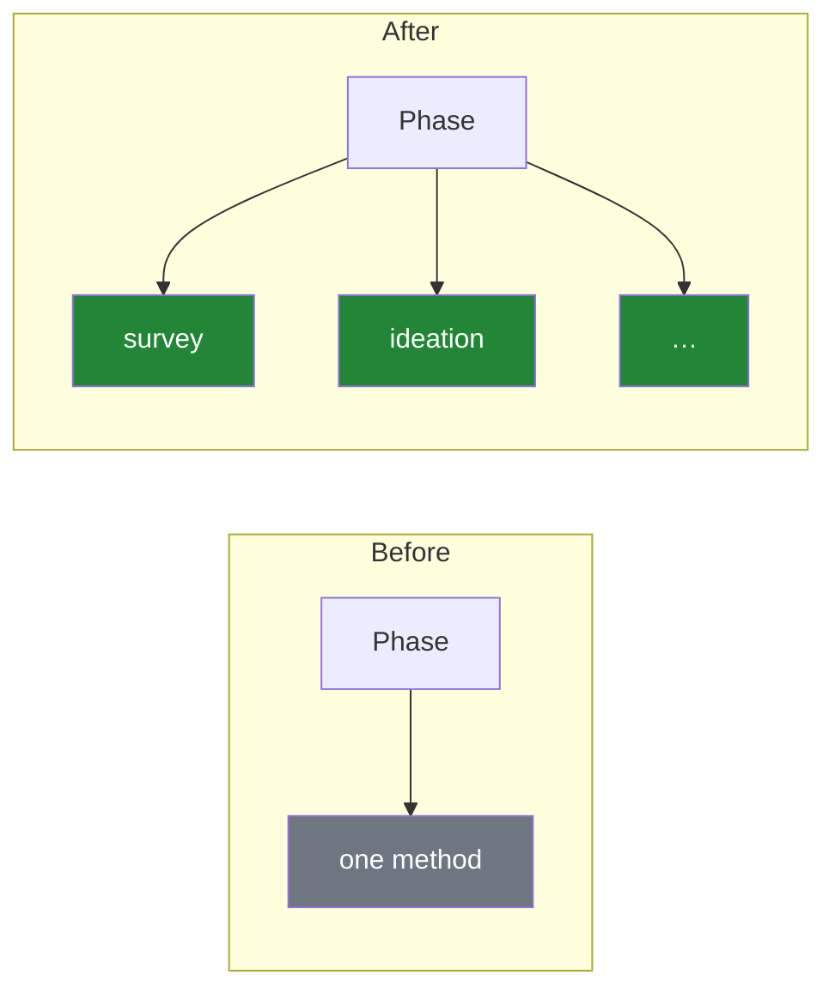
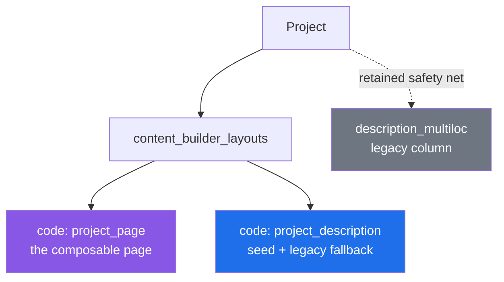
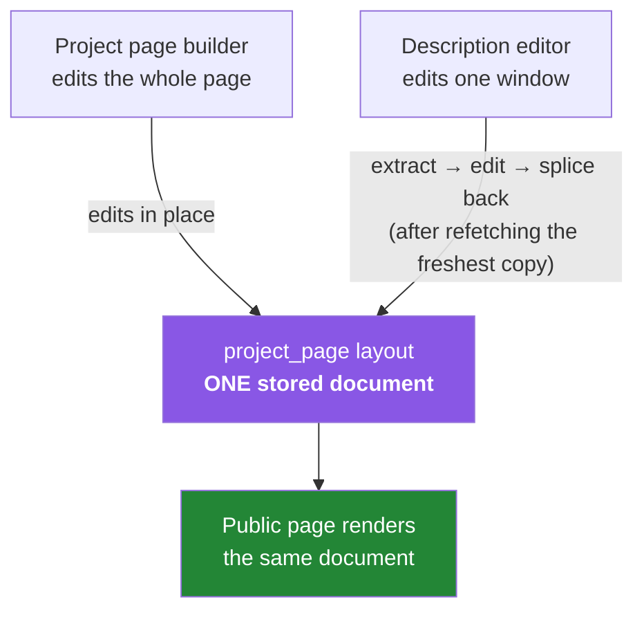
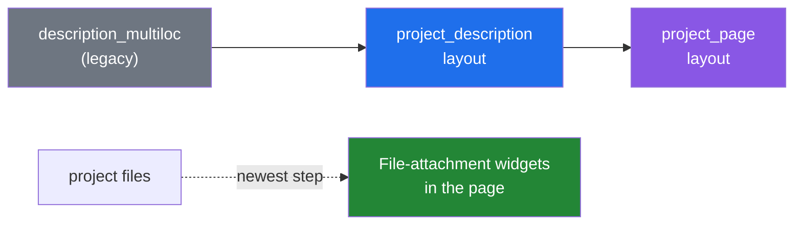

<!--
View on GitHub to see the diagrams rendered (mermaid); each `---` is a section break.
Code stays off-screen — the links point to master for click-through.
-->

# Parallel Participation — Technical Showcase
### Supporting parallel participation in the user interface

The rebuild that lets one phase run many methods · foundations, where we are, where we're going

---

## 1 · The problem

A phase could run **exactly one** participation method — because the project page was **hard-coded markup**, not composable content. There was nowhere to put a second method.

> Parallel participation was **90% a page-architecture problem**, 10% new features.

---

## 2 · The insight — make the page composable

Turn the project page into **content-builder content**: one table, `content_builder_layouts`, backs it. Additive — a new `code`, **no schema change**.

Once the page is composable, "parallel" becomes *"let one phase widget hold more than one method."*

---

## 3 · ⭐ One document, two editing surfaces, zero drift

The description and the full page are **the same stored craftjs document** (`project_page`). The description editor is just a **window** into a subtree of it.

**Why it can't drift:** there's no second copy to keep in sync. On save the description edit is spliced into the *freshest* page, so a simultaneous edit elsewhere is preserved, never clobbered.

The three pieces that make it work:
[the window (extract / splice)](https://github.com/CitizenLabDotCo/citizenlab/blob/master/front/app/components/ProjectPageBuilder/descriptionSection.ts) · [refetch-then-splice on save](https://github.com/CitizenLabDotCo/citizenlab/blob/master/front/app/containers/DescriptionBuilder/index.tsx#L128-L148) · [normalize on every read](https://github.com/CitizenLabDotCo/citizenlab/blob/master/front/app/components/ProjectPageBuilder/defaultLayout.ts#L190-L271)

---

## 4 · Shipped safely — lossless, reversible migrations

Every existing project moved onto the builder **without losing anything and without a big-bang** — dry-runnable, idempotent rake tasks, old data retained.

- Rich content (images, video, CTAs) survives via a lossless [**bridge widget**](https://github.com/CitizenLabDotCo/citizenlab/blob/master/front/app/components/DescriptionBuilder/Widgets/RichTextMultiloc/index.tsx) — still fully editable, not frozen HTML.
- The newest application of the same pattern: **project files become File-attachment widgets** inside the page ([#14352](https://github.com/CitizenLabDotCo/citizenlab/pull/14352), in flight).

---

## 5 · Where we are — and what's in flight

**✅ Live for all clients** — the redesigned back office + public page are the default ([#14339](https://github.com/CitizenLabDotCo/citizenlab/pull/14339)).

**🟢 In flight**
- [#14295](https://github.com/CitizenLabDotCo/citizenlab/pull/14295) — surveys alongside other methods (drag any element on the page). Includes the first parallel method — running **extra surveys in parallel** ([#14303](https://github.com/CitizenLabDotCo/citizenlab/pull/14303), merged into this branch) — which reaches master when #14295 lands.
- [#14343](https://github.com/CitizenLabDotCo/citizenlab/pull/14343) — participation box reworked to render multiple methods
- [#14352](https://github.com/CitizenLabDotCo/citizenlab/pull/14352) — file authoring moved into the page builder

---

## The one idea to remember

> We made the project page a **single composable document** — one source of truth, edited from two surfaces without drift — so a phase can finally hold **more than one way to participate.**

Thanks 🙏 — questions?
